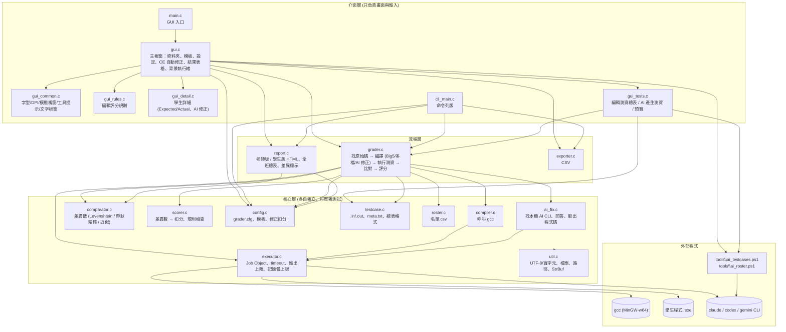
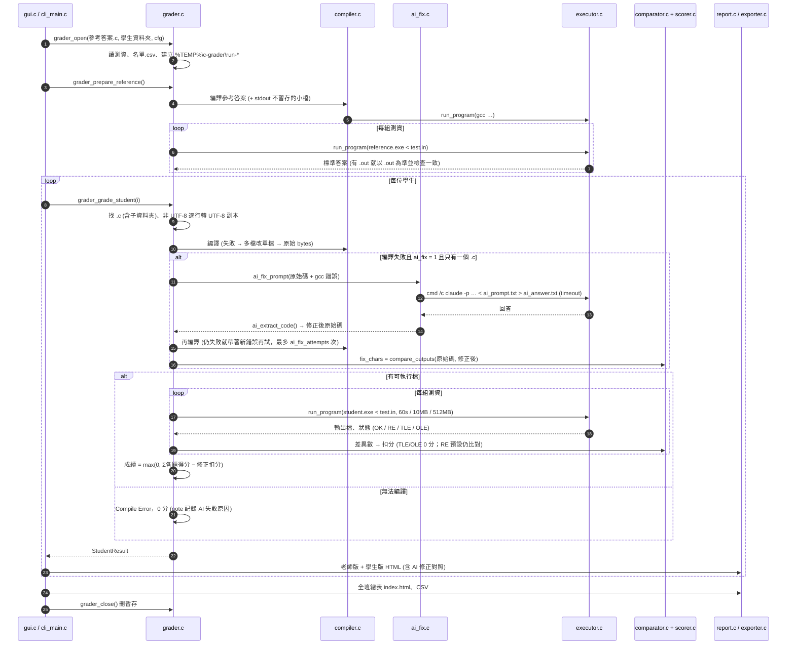
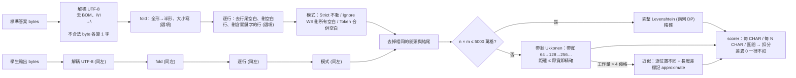
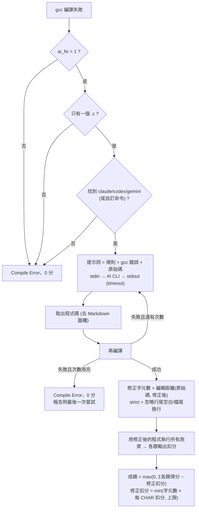
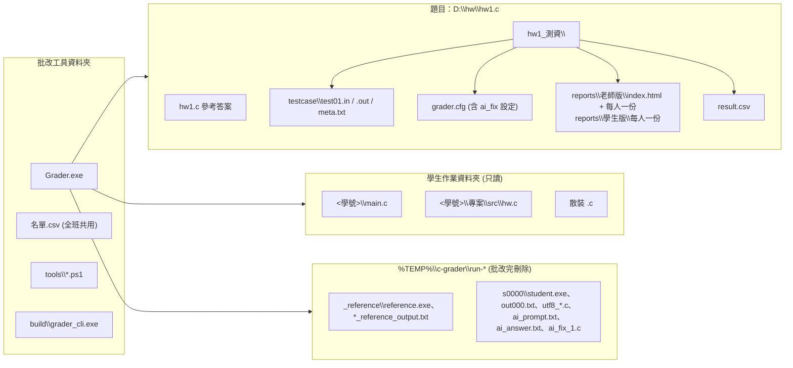

# 架構圖 (Mermaid)

在 VS Code (內建 Markdown 預覽支援 Mermaid)、GitHub、或 https://mermaid.live 都能直接看圖。
文字版的分層說明見 [DESIGN.md](DESIGN.md)。

## 1. 模組與相依關係

## 2. 一次批改的流程 (含 CE 自動修正)

## 3. 差異數 (CHAR) 的計算管線

## 4. 編譯失敗 (CE) 的處理與扣分

## 5. 檔案與資料夾

